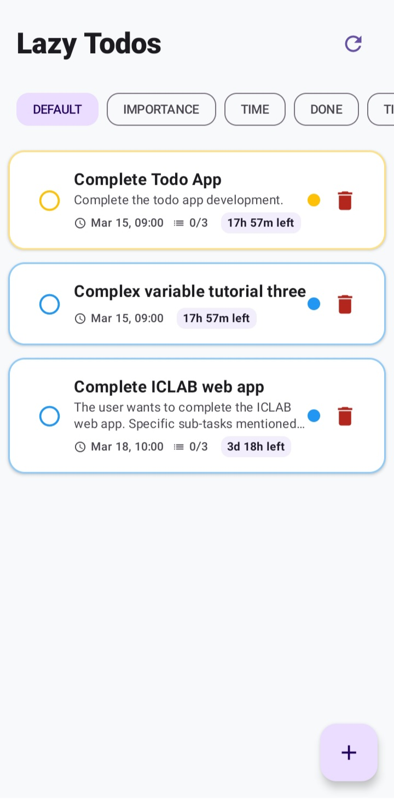
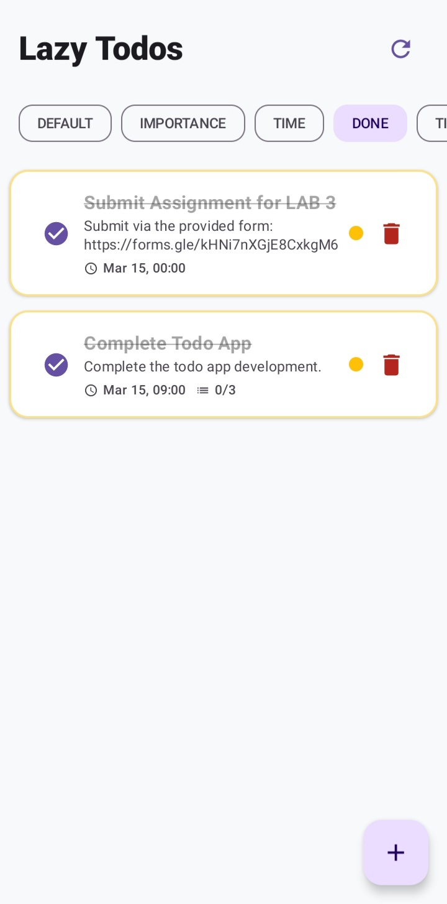
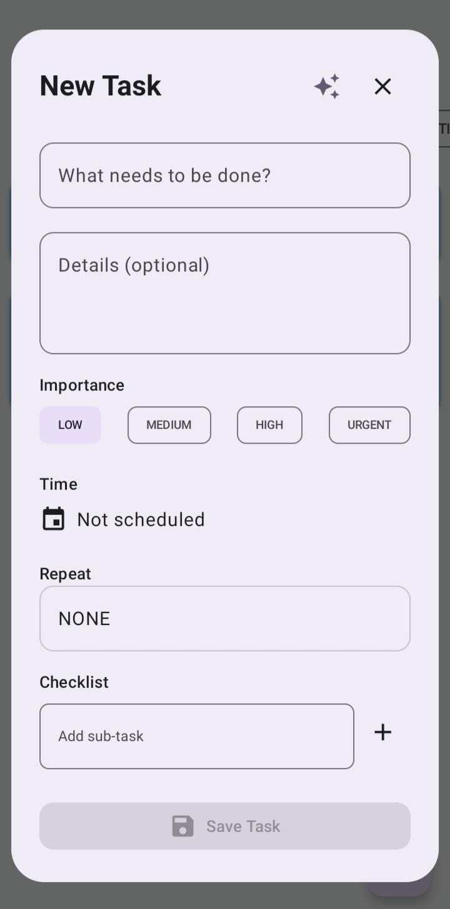
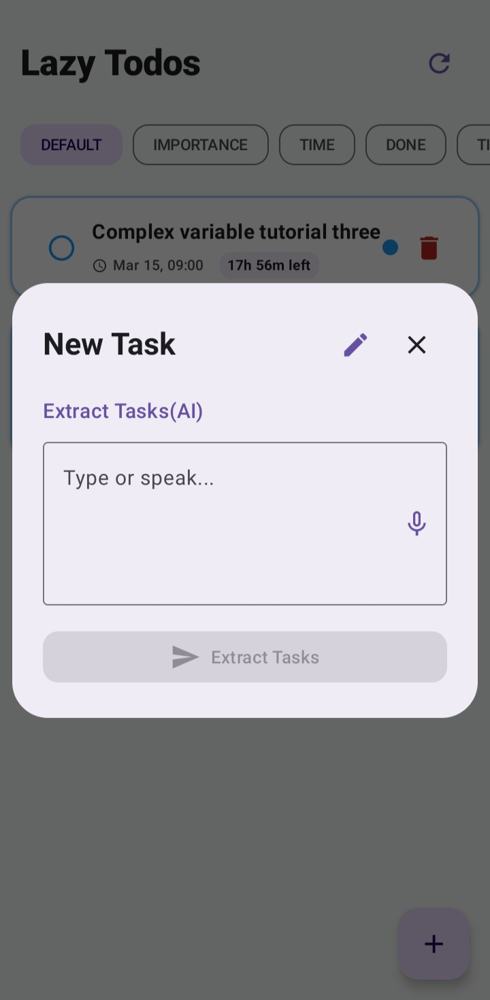
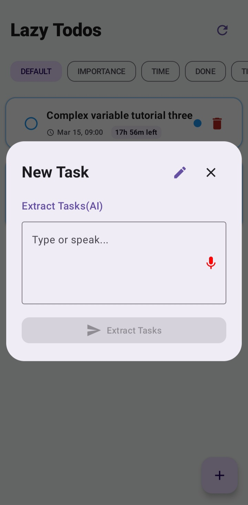
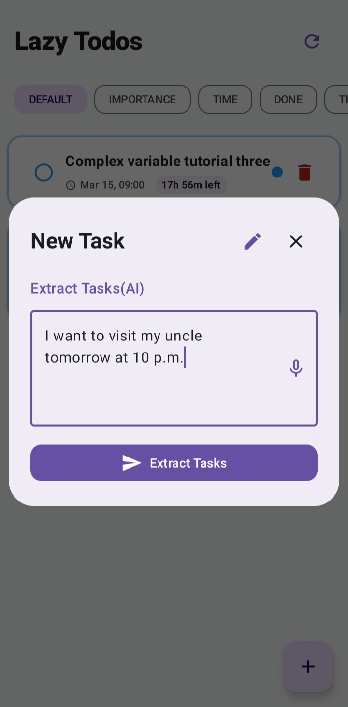
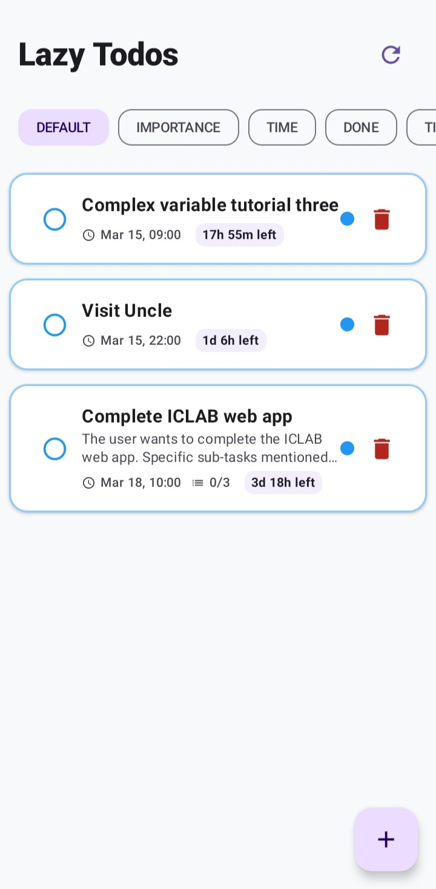
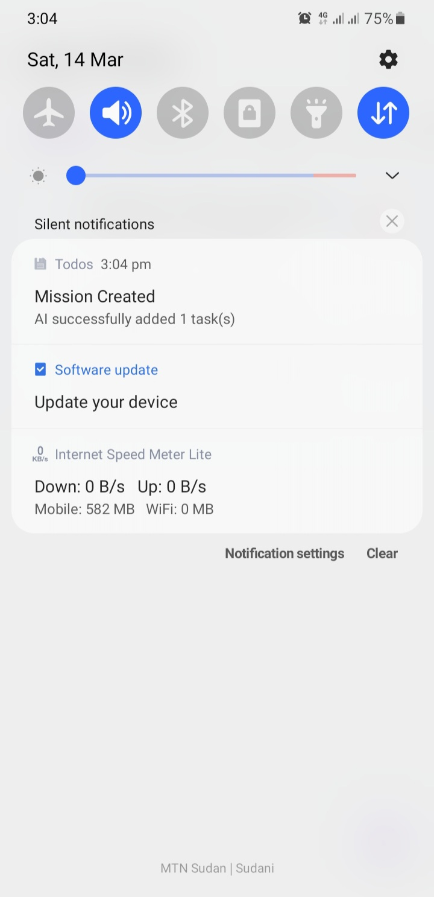
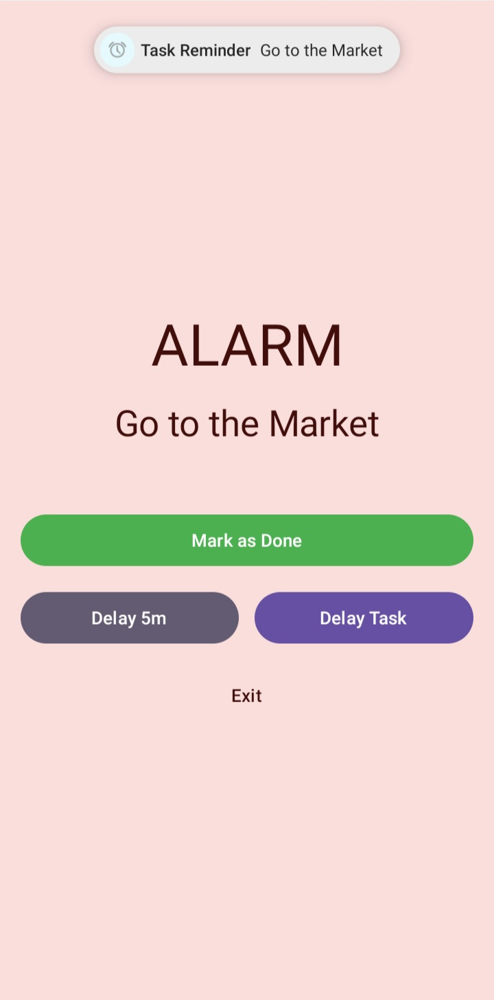
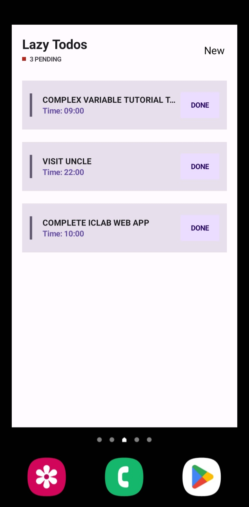

# 📱 Lazy Todos – AI‑Powered Task Manager

A modern Android todo application built with **Jetpack Compose**, **Firebase**, and **Google Gemini AI**.  
Create tasks manually or simply describe them in natural language – the AI will parse your message, extract tasks, and schedule them intelligently.

---

## ✨ Features

- **Manual task creation** with title, details, importance (LOW–URGENT), date/time, repeat options, and subtasks.
- **AI‑powered task extraction** – type or speak a sentence like  
  *“I need to buy groceries tomorrow at 5pm and call mom on Saturday”* – the app automatically creates structured tasks with proper scheduling.
- **Smart scheduling** – avoids alert fatigue by spacing subtasks 30–60 minutes apart.
- **Alarms & reminders** – exact alarms (with permission) and a 5‑minute reminder before each task.
- **Repeat modes** – none, minutely, hourly, daily, weekly, monthly, or selected days of the week.
- **Timeline view** – see all upcoming tasks (including subtasks) sorted by time.
- **Firestore sync** – tasks are stored locally and synced with Firebase Firestore.
- **Home screen widget** – shows pending tasks with a clean, rounded design; tap “DONE” to mark a task as completed.
- **Dark / Light theme** – adapts to system settings.

---

## 🛠 Tech Stack

- **Language:** Kotlin
- **UI Toolkit:** Jetpack Compose
- **Architecture:** MVVM (ViewModel, Repository, StateFlow)
- **Persistence:** Firebase Firestore + local JSON file (`todos.json`)
- **Background processing:** WorkManager
- **AI:** Google Gemini API (`gemini-2.5-flash-lite`)
- **Alarms:** `AlarmManager` with exact alarms and full‑screen intents
- **Speech recognition:** Android `SpeechRecognizer`
- **Widgets:** Jetpack Glance (`glance-appwidget`, `glance-material3`)

---

## 📁 Project Structure

```
app/src/main/java/com/majzoub/todos/
├── model/               # Data classes
├── data/                # Repository & local/remote data handling
├── viewmodel/           # ViewModels for UI state
├── ui/                  # Jetpack Compose UI screens & themes
├── receiver/            # BroadcastReceivers and alarm scheduler
├── worker/              # WorkManager workers (AI processing)
├── widget/              # Home screen widget using Glance
├── MainActivity.kt      # Entry point with permission handling
└── AlarmActivity.kt     # Full‑screen alarm activity
```

### 🔹 Model Layer (`model/`)

- **`Todo.kt`**  
  Defines `TodoTime` (structured date/time with year, month, day, hour, minute, second) and `Todo`.  
  - `TodoTime.UNSCHEDULED` (all zeros) marks an unscheduled task.  
  - Extension functions `toTimestamp()` and `Long.toTodoTime()` allow seamless conversion between `TodoTime` and Unix timestamps (used for alarms).  
  - `Todo` contains `id`, `title`, `details`, `importance` (enum), `time` (now `TodoTime`), `subTodos`, `isDone`, `repeatMode` (enum), `repeatDays`.

### 🔹 Data Layer (`data/`)

- **`TodoRepository.kt`**  
  Central data source.  
  - Maintains an in‑memory `StateFlow<List<Todo>>` backed by a local JSON file.  
  - Reads/writes the local file using `kotlinx.serialization`.  
  - Syncs with Firestore – converts `TodoTime` to/from nested maps.  
  - Delegates alarm scheduling to `AlarmScheduler`.  
  - **New:** Calls `TodoWidget().updateAll(context)` after any data change to refresh the home screen widget.

### 🔹 ViewModel Layer (`viewmodel/`)

- **`TodoViewModel.kt`**  
  Exposes `filteredTodos` based on selected filter (`DEFAULT`, `IMPORTANCE`, `TIME`, `DONE`, `TIMELINE`).  
  - Uses `toTimestamp()` for sorting.  
  - Provides `processAiPromptInBackground()` to enqueue an `AiTodoWorker`.  
  - Observes WorkManager status to show loading indicators.  
  - `addTodo()` now accepts a `TodoTime` parameter.

### 🔹 UI Layer (`ui/`)

- **`TodoScreen.kt`**  
  Main screen with a `LazyColumn` of todos, filter chips, and a FAB to open the add/edit dialog.  
  - `TodoItem` and `TimelineItem` composables display a todo.  
  - `TodoEditDialog` – form for creating/editing tasks.  
    - Holds `todoTime` as `TodoTime`.  
    - Date/time pickers update the `TodoTime` object.  
    - AI mode toggles `AiPromptSection`.  
  - `AiPromptSection` – uses `SpeechRecognizer` for voice input and calls `viewModel.processAiPromptInBackground()`.

- **`theme/`**  
  `Color.kt`, `Theme.kt`, `Type.kt` – define custom colors (importance‑based) and theming.

### 🔹 Receivers & Alarm Handling (`receiver/`)

- **`TodoAlarmReceiver.kt`**  
  `BroadcastReceiver` that receives intents from `AlarmManager`.  
  - For a 5‑minute reminder: shows a simple notification.  
  - For the actual alarm: launches `AlarmActivity` as a full‑screen intent and displays a high‑priority notification.

- **`AlarmScheduler.kt`**  
  Helper class to schedule and cancel alarms.  
  - Uses `todo.time.toTimestamp()` to get the Unix time.  
  - Schedules exact alarms (with `AlarmManager.setAlarmClock` or fallback) and a 5‑minute reminder.  
  - Recursively handles subtasks.

### 🔹 Workers (`worker/`)

- **`AiTodoWorker.kt`**  
  `CoroutineWorker` that calls the Gemini API.  
  - Builds a detailed prompt containing the current date/time, timezone, and interpretation rules.  
  - Instructs the model to output JSON with `time` as a structured object (`{year, month, day, hour, minute, second}`).  
  - Parses the response into `List<Todo>` and saves each one.  
  - Schedules alarms for tasks/subtasks.  
  - Shows progress/success/error notifications.

### 🔹 Widget (`widget/`)

- **`TodoWidget.kt`**  
  Home screen widget built with Jetpack Glance.  
  - Displays active tasks sorted by time.  
  - Styled with rounded corners, shadows, and importance‑colored accents.  
  - Tapping the “DONE” button triggers `ToggleTodoAction` (an `ActionCallback`) to mark the task as done and update the widget.  
  - The widget updates automatically when data changes (thanks to `updateAll()` calls in the repository).

### 🔹 Activities

- **`MainActivity.kt`**  
  Entry point.  
  - Shows a splash screen (`installSplashScreen`).  
  - Checks and requests notification and exact alarm permissions.  
  - Sets content to `TodoScreen`.

- **`AlarmActivity.kt`**  
  Full‑screen activity shown when an alarm fires.  
  - Plays an alarm sound, keeps screen on, and wakes device.  
  - Buttons: **Mark as Done**, **Delay 5m**, **Delay Task** (custom time), **Exit**.  
  - Uses `toTodoTime()` to convert new timestamps back to `TodoTime` when saving.

---

## 🚀 Setup Instructions

### Prerequisites
- Android Studio (latest stable)
- Android SDK (min API 24, target 35)
- A Firebase project (optional, for cloud sync)
- A [Google Gemini API key](https://aistudio.google.com/app/apikey)

### 1. Clone the repository
```bash
git clone https://github.com/majzoub-alsiddig/lazyTodo.git
```

### 2. Add your Gemini API keys
Open `AiTodoWorker.kt` and replace the placeholder list with your actual keys:
```kotlin
private val apiKeys = listOf("YOUR_API_KEY_1", "YOUR_API_KEY_2", ...)
```
Multiple keys are supported for fallback.

### 3. Firebase setup (optional)
- If you want to use Firestore, create a Firebase project and download the `google-services.json` file.
- Place it in the `app/` directory.
- If you don’t use Firebase, you can remove the Firestore code from `TodoRepository` and rely only on local storage.

### 4. Build & Run
- Connect a device/emulator with API 24+.
- Click **Run** in Android Studio.

---

## 🔄 How It Works – Key Flows

### ✍️ Manual Task Creation
1. User taps **+** FAB.
2. Fills form (title, details, importance, date/time, repeat, subtasks).  
   - Date/time is stored as a `TodoTime` object.
3. On save, `viewModel.addTodo()` is called with `TodoTime`.
4. Repository saves to local JSON and Firestore, and schedules alarms via `AlarmScheduler` (converting `TodoTime` to timestamp).

### 🤖 AI Task Generation
1. User switches to **AI mode** in the dialog, types or speaks a sentence, and taps **Extract Tasks**.
2. `AiTodoWorker` enqueued by ViewModel.
3. Worker builds a prompt with current context and sends it to Gemini.
4. Gemini returns JSON where each `time` is a structured object.
5. Worker deserialises into `List<Todo>` and saves each one.
6. Alarms are scheduled for each task/subtask.

### ⏰ Alarm & Notification
- When the scheduled time arrives, `AlarmScheduler` triggers `TodoAlarmReceiver`.
- For a main alarm, it launches `AlarmActivity` and shows a full‑screen notification.
- User actions (mark done, delay) update the todo (using `toTodoTime()` for new times) and reschedule.

### 📱 Home Screen Widget
- Displays pending tasks, each with a “DONE” button.
- Clicking “DONE” executes `ToggleTodoAction`, which marks the task done and calls `TodoWidget().updateAll(context)` to refresh all widget instances.
- Widget updates also occur after any data change (add, edit, delete, sync) via repository calls.

---

## 🔐 Permissions

The app requests:
- **`POST_NOTIFICATIONS`** (Android 13+) – to show alarm and worker notifications.
- **Exact alarm permission** (Android 12+) – the user is redirected to system settings if not granted.

These are handled in `MainActivity`.

---

## 📸 Screenshots

| Screen | Preview |
|--------|---------|
| **Main UI** |  |
| **Done Filter View** |  |
| **Add Task (Default Mode)** |  |
| **Add Task (AI Mode)** |  |
| **Add Task (AI Voice Mode)** |  |
| **Add Task (AI with Real Prompt)** |  |
| **AI‑Added Todo Result** |  |
| **Notification Preview** |  |
| **Alarm Screen** |  |
| **Widget View** |  |

---

## 📄 License

This project is licensed under the MIT License – see the [LICENSE](LICENSE) file for details.

---

## 🤝 Contributing

Contributions are welcome! Feel free to open issues or submit pull requests.

---

## 🙌 Acknowledgements

- [Google Gemini API](https://deepmind.google/technologies/gemini/)
- [Firebase](https://firebase.google.com/)
- [Jetpack Compose](https://developer.android.com/jetpack/compose)
- [Jetpack Glance](https://developer.android.com/jetpack/compose/glance)
- [Kotlin Coroutines & Flow](https://kotlinlang.org/docs/coroutines-overview.html)